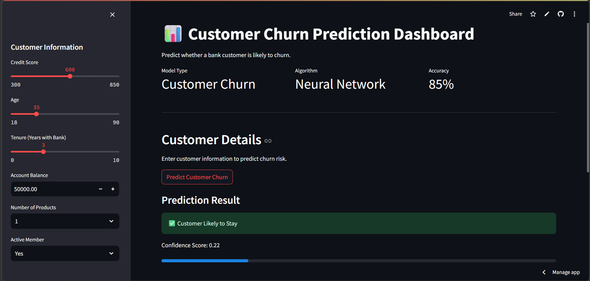
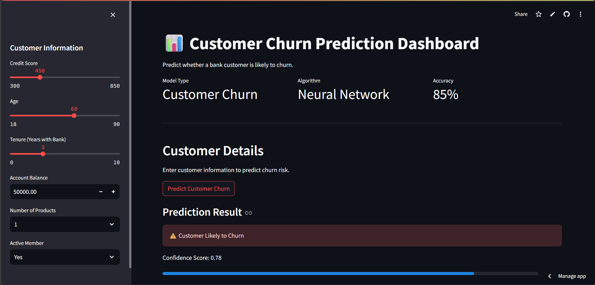
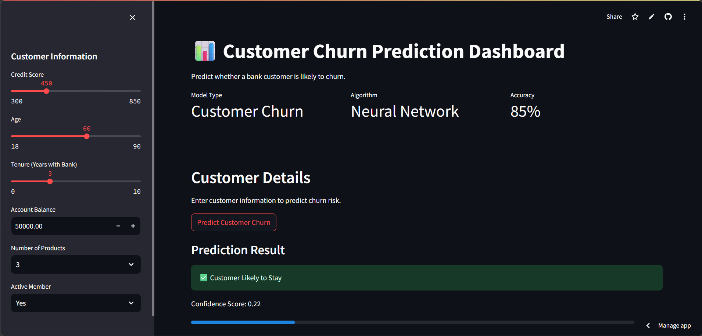
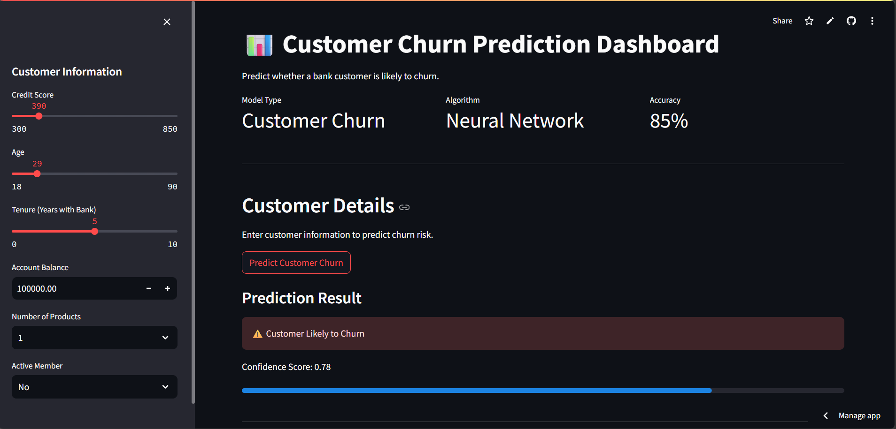

# Customer Churn Prediction 📊

<div align="center">


<br/>

**An end-to-end machine learning system that predicts whether a bank customer will churn —  
built with Neural Networks and deployed as an interactive Streamlit web application.**

</div>

---

## 📌 Project Overview

Customer churn costs banks millions annually. Identifying at-risk customers **before** they leave allows businesses to take targeted retention actions — saving revenue and improving customer relationships 🎯

This project answers the question:

> **"Given a customer's demographic and banking profile, how likely are they to leave?"**

---

## 🚀 Live Demo

<div align="center">

[](https://customer-churn-prediction-pg2spsbjlksybbuyappw8hf.streamlit.app/)
[](notebooks/churn_analysis.ipynb)
[](https://www.kaggle.com/datasets/rjmanoj/credit-card-customer-churn-prediction)

</div>

---

## 🖼️ App Preview

<p align="center">
  
  &nbsp;&nbsp;
  
</p>
<p align="center">
  <em>Left: Customer predicted to stay &nbsp;|&nbsp; Right: Customer predicted to churn</em>
</p>

<p align="center">
  
  &nbsp;&nbsp;
  
</p>

---

## 📂 Project Structure

```
Customer-Churn-Prediction/
│
├── app/                          # Streamlit web application
│   └── app.py
│
├── data/
│   └── raw/                      # Raw dataset
│
├── models/
│   ├── churn_prediction_model.h5 # Trained Neural Network
│   └── scaler.pkl                # Fitted StandardScaler
│
├── notebooks/
│   └── churn_analysis.ipynb      # EDA + Model training notebook
│
├── src/                          # Modular source code
├── requirements.txt
└── README.md
```

---

## 🛠️ Tech Stack

<div align="center">

| Category | Tools |
|---|---|
| **Language** | Python 3.11 |
| **Deep Learning** | TensorFlow, Keras |
| **ML & Data** | Scikit-learn, Pandas, NumPy |
| **Visualization** | Matplotlib, Seaborn |
| **Deployment** | Streamlit |

</div>

---

## ⚙️ Model Training Process

1. Data cleaning and preprocessing 🧹
2. Exploratory Data Analysis (EDA) 🔎
3. Data scaling using **StandardScaler** ⚖️
4. Model training using a **Neural Network** 🧠
5. Model evaluation 📊
6. Model saving for deployment 💾

---

## 📈 Model Performance

- **Accuracy:** ~85% (may vary depending on training)
- **Task:** Binary classification (Churn vs Not Churn)

---

## 📊 Model Comparison

<div align="center">

| Model | Accuracy |
|---|---|
| Logistic Regression | 82% |
| Random Forest | 85% |
| SVM | 86% |
| ✅ **Neural Network** | **86%** |

</div>

> **Neural Network (TensorFlow/Keras)** was selected as the final model for deployment due to its performance and scalability.

---

## 🧠 ML Pipeline

```
Raw Data  →  Cleaning  →  EDA  →  Feature Scaling  →  Model Training  →  Evaluation  →  Deployment
```

---

### Features Used for Prediction

<div align="center">

| Feature | Description |
|---|---|
| `CreditScore` | Customer's credit score |
| `Age` | Customer's age |
| `Balance` | Account balance |
| `Tenure` | Years as a customer |
| `NumOfProducts` | Number of bank products held |
| `IsActiveMember` | Whether the customer is active |

</div>

---

## ▶️ Run Locally

```bash
# 1. Clone the repository
git clone https://github.com/mysticalayushi/Customer-Churn-Prediction.git
cd Customer-Churn-Prediction

# 2. Install dependencies
pip install -r requirements.txt

# 3. Launch the Streamlit app
streamlit run app/app.py
```

Or explore the analysis notebook:
```bash
jupyter notebook notebooks/churn_analysis.ipynb
```

---

## 🔮 Future Improvements

- [ ] Hyperparameter tuning with Optuna
- [ ] Feature importance visualization (SHAP values)
- [ ] Add SMOTE for handling class imbalance
- [ ] REST API with FastAPI for model serving

---

## 👩‍💻 Author

<div align="center">

**Ayushi Rai**  
[](https://github.com/mysticalayushi)

</div>

---

<div align="center">
<sub>If you found this project helpful, consider giving it a ⭐ on GitHub!</sub>
</div>
